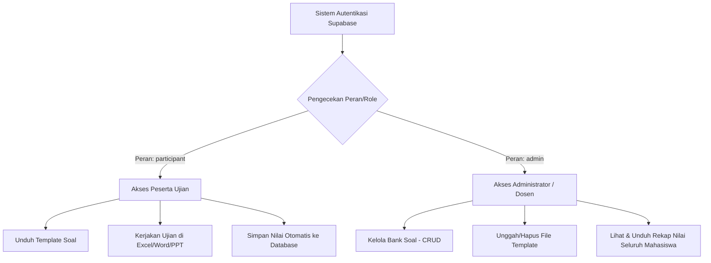

# Dokumentasi Skema Database & Analisis Peran (Skripsi)
## Sistem Ujian Praktik Aplikasi Perkantoran Interaktif (ExamQuiz)

Dokumen ini disusun untuk membantu penulisan bab perancangan database (skema basis data) dan analisis kebutuhan hak akses (peran/role) pada laporan skripsi Anda.

---

## 1. Rasionalisasi Pembagian Peran (Role-Based Access Control)
Dalam sistem ujian praktik ini, terdapat dua peran utama yang dikonfigurasi melalui kolom `role` pada profil pengguna. Pembagian ini didasarkan pada prinsip keamanan informasi **Least Privilege** (hak akses minimal) untuk menjaga integritas proses evaluasi.

### A. Peran: `participant` (Peserta Ujian / Mahasiswa)
*   **Tujuan Akademis**: Sebagai subjek yang diuji kemampuannya dalam mengoperasikan aplikasi perkantoran (Word, Excel, PowerPoint).
*   **Batasan Akses**:
    *   Hanya memiliki hak baca (*read-only*) terhadap daftar butir soal ujian.
    *   Hanya diperbolehkan menulis (*insert*) data hasil ujian mereka sendiri ke tabel sesi ujian (`exam_sessions`) dan jawaban (`session_answers`).
    *   Tidak diperbolehkan melihat jawaban benar secara langsung di database atau mengubah nilai yang telah tersimpan.
*   **Alasan Keamanan (Integritas Ujian)**: Pembatasan ini mutlak diperlukan guna mencegah kecurangan (misal: mahasiswa mengubah nilai mereka sendiri secara manual di database atau memanipulasi soal).

### B. Peran: `admin` (Administrator / Pengawas / Dosen)
*   **Tujuan Akademis**: Sebagai fasilitator, pengawas, dan penilai yang mengelola jalannya ujian serta melakukan rekapitulasi hasil evaluasi belajar.
*   **Cakupan Akses**:
    *   Memiliki akses penuh (*Create, Read, Update, Delete - CRUD*) pada tabel bank soal dan berkas template.
    *   Dapat melihat rekapitulasi nilai seluruh mahasiswa untuk keperluan penilaian akhir semester dan analisis butir soal.
*   **Alasan Keamanan**: Menjamin bahwa pengelolaan konten ujian hanya dapat dimodifikasi oleh pihak yang berwenang (dosen/penguji).

---

## 2. Usulan Transformasi Penamaan Skema Database (Akademis)
Berikut adalah usulan perubahan nama tabel dan kolom dari versi teknis (*development*) ke versi formal yang lebih cocok untuk penulisan Bab IV (Implementasi & Pembahasan) pada skripsi Anda.

### A. Tabel 1: Profil Pengguna (`profiles` ➔ `pengguna`)
*   **Tujuan Tabel**: Menyimpan data identitas akademik pengguna yang terintegrasi dengan Supabase Auth.
*   **Skema dan Penjelasan Kolom**:

| Nama Teknis | Usulan Nama Akademis | Tipe Data | Deskripsi & Tujuan Kolom |
| :--- | :--- | :--- | :--- |
| `id` | `id_pengguna` | `UUID` (PK) | Penghubung unik yang berelasi langsung dengan sistem autentikasi (`auth.users`). |
| `full_name` | `nama_lengkap` | `VARCHAR` | Menyimpan nama lengkap mahasiswa/dosen untuk keperluan sertifikat & laporan nilai. |
| `nim` | `nomor_induk` | `VARCHAR` | Nomor Induk Mahasiswa (NIM) sebagai identifier unik akademik peserta. |
| `role` | `peran` | `VARCHAR` | Menentukan tingkat otorisasi pengguna (`participant` atau `admin`). |

---

### B. Tabel 2: Bank Soal (`questions` ➔ `butir_soal`)
*   **Tujuan Tabel**: Menyimpan butir-butir soal ujian untuk setiap jenis aplikasi perkantoran beserta indikator penilaian otomatisnya.
*   **Skema dan Penjelasan Kolom**:

| Nama Teknis | Usulan Nama Akademis | Tipe Data | Deskripsi & Tujuan Kolom |
| :--- | :--- | :--- | :--- |
| `id` | `id_soal` | `BIGINT` (PK) | Identifikasi unik setiap butir soal. |
| `exam_type` | `jenis_aplikasi` | `VARCHAR` | Kategori aplikasi perkantoran yang diuji (`word`, `excel`, `ppt`). |
| `level` | `kategori_ujian` | `VARCHAR` | Tingkat ujian (misal: `praktik`, `teori`). |
| `question_order`| `nomor_urut` | `INTEGER` | Urutan tampilnya soal pada taskpane add-in. |
| `points` | `bobot_nilai` | `INTEGER` | Nilai/skor maksimal jika mahasiswa berhasil menjawab soal dengan benar. |
| `check_type` | `metode_penilaian` | `VARCHAR` | Cara evaluasi: `api` (otomatis oleh Office.js) atau `confirm` (manual pengawas). |
| `title` | `judul_tugas` | `VARCHAR` | Topik utama penugasan (contoh: "Format Price"). |
| `description` | `instruksi_tugas` | `TEXT` | Perintah detail tindakan yang harus dilakukan mahasiswa di lembar kerja Excel/Word. |
| `steps` | `langkah_verifikasi`| `JSONB` (Array)| Langkah-langkah detail pengecekan teknis oleh sistem. |
| `hint` | `petunjuk_bantuan` | `TEXT` | Petunjuk menu atau tab untuk membantu mahasiswa yang kesulitan. |

---

### C. Tabel 3: Sesi Ujian (`exam_sessions` ➔ `sesi_ujian`)
*   **Tujuan Tabel**: Mencatat riwayat keikutsertaan ujian mahasiswa, durasi pengerjaan, serta status kelulusan mereka.
*   **Skema dan Penjelasan Kolom**:

| Nama Teknis | Usulan Nama Akademis | Tipe Data | Deskripsi & Tujuan Kolom |
| :--- | :--- | :--- | :--- |
| `id` | `id_sesi` | `UUID` (PK) | Identifikasi unik untuk satu kali sesi ujian mahasiswa. |
| `user_id` | `id_pengguna` | `UUID` (FK) | Relasi ke tabel `pengguna` untuk mengidentifikasi siapa yang menempuh ujian. |
| `exam_type` | `jenis_aplikasi` | `VARCHAR` | Jenis ujian perkantoran yang diambil pada sesi tersebut. |
| `level` | `kategori_ujian` | `VARCHAR` | Kategori tingkat ujian yang diikuti. |
| `max_score` | `skor_maksimum` | `INTEGER` | Total bobot nilai dari semua soal dalam paket ujian tersebut. |
| `total_score` | `skor_diperoleh` | `INTEGER` | Akumulasi nilai akhir yang berhasil dikumpulkan oleh mahasiswa. |
| `status` | `status_kelulusan`| `VARCHAR` | Menunjukkan status akhir kelayakan: `in_progress`, `lulus`, atau `tidak_lulus`. |
| `started_at` | `waktu_mulai` | `TIMESTAMP` | Waktu persis saat mahasiswa menekan tombol "Mulai Ujian" (untuk hitung durasi). |
| `finished_at` | `waktu_selesai` | `TIMESTAMP` | Waktu saat mahasiswa menekan tombol "Selesai & Kirim Ujian". |

---

### D. Tabel 4: Detail Jawaban Sesi (`session_answers` ➔ `evaluasi_jawaban`)
*   **Tujuan Tabel**: Menyimpan hasil penilaian per butir soal untuk setiap sesi ujian. Ini sangat krusial dalam skripsi untuk menunjukkan tingkat akurasi sistem penilai otomatis.
*   **Skema dan Penjelasan Kolom**:

| Nama Teknis | Usulan Nama Akademis | Tipe Data | Deskripsi & Tujuan Kolom |
| :--- | :--- | :--- | :--- |
| `id` | `id_evaluasi` | `BIGINT` (PK) | Identifikasi unik untuk catatan evaluasi per soal. |
| `session_id` | `id_sesi` | `UUID` (FK) | Relasi ke tabel `sesi_ujian` untuk mengelompokkan jawaban per mahasiswa. |
| `question_id` | `id_soal` | `BIGINT` (FK) | Relasi ke tabel `butir_soal` untuk merujuk soal mana yang dijawab. |
| `score` | `skor_diperoleh` | `INTEGER` | Skor yang didapat mahasiswa untuk butir soal tersebut (0 atau maksimal sesuai bobot). |
| `detail` | `catatan_sistem` | `TEXT` | Log teknis pemeriksaan otomatis (misal: "Formula ditemukan: =D6*F6"). |
| `status` | `status_jawaban` | `VARCHAR` | Status kebenaran pengerjaan mahasiswa (`benar` atau `salah`). |

---

### E. Tabel 5: Berkas Template Ujian (`exam_files` ➔ `berkas_template`)
*   **Tujuan Tabel**: Mengelola tautan dokumen awal (starter file) yang akan dibuka mahasiswa saat ujian dimulai.
*   **Skema dan Penjelasan Kolom**:

| Nama Teknis | Usulan Nama Akademis | Tipe Data | Deskripsi & Tujuan Kolom |
| :--- | :--- | :--- | :--- |
| `id` | `id_berkas` | `BIGINT` (PK) | Identifikasi unik berkas template. |
| `exam_type` | `jenis_aplikasi` | `VARCHAR` | Jenis ujian yang menggunakan template berkas tersebut. |
| `file_path` | `tautan_berkas` | `TEXT` | URL absolut dari Supabase Storage tempat berkas `.xlsx`/`.docx`/`.pptx` disimpan. |
| `is_available` | `status_aktif` | `BOOLEAN` | Status kesiapan berkas untuk diunduh oleh peserta ujian. |
| `updated_at` | `waktu_pembaruan`| `TIMESTAMP` | Kapan berkas template terakhir kali diperbarui oleh admin. |

---

## 3. Pentingnya Menyimpan Jawaban di Database (Urgensi Metodologi Penelitian Skripsi)
Sebagai bahan penulisan **Bab III (Metodologi Penelitian)** atau **Bab IV (Hasil dan Analisis)**, penyimpanan hasil pengerjaan per-soal di database (`evaluasi_jawaban`) memiliki peran yang sangat penting secara ilmiah:

1.  **Validitas Hasil Evaluasi (Evidence-Based Grading)**:
    *   Setiap skor yang diperoleh mahasiswa memiliki bukti audit yang kuat di kolom `catatan_sistem` (seperti formula `=D6*F6` yang terbaca secara real-time dari API Office.js). Ini membuktikan bahwa penilaian benar-benar objektif berdasarkan kondisi berkas, bukan subjektivitas pemeriksa.
2.  **Analisis Kesulitan Butir Soal (Item Difficulty Analysis)**:
    *   Dengan menyimpan status `benar` / `salah` per nomor soal dari ratusan responden mahasiswa, Anda dapat melakukan analisis statistik deskriptif untuk mengetahui soal nomor berapa yang paling banyak salah dijawab. Ini merupakan poin analisis yang sangat disukai dosen penguji skripsi.
3.  **Auditabilitas Data (Data Integrity)**:
    *   Karena tersinkronisasi langsung dengan Supabase Auth, setiap baris data diikat oleh `id_pengguna` (UUID), sehingga memastikan data nilai tidak tertukar antar mahasiswa dan tidak dapat disisipkan secara ilegal tanpa proses autentikasi formal.
